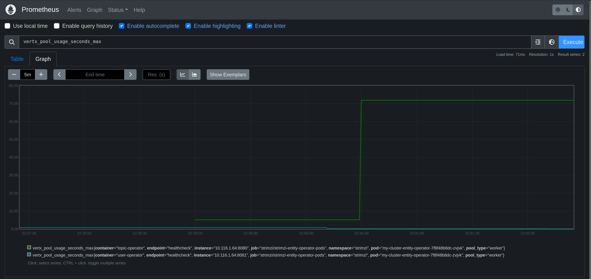

# CRE-2024-006: Kafka Topic Operator Thread Blocked

## Overview

[Apache Kafka](https://kafka.apache.org/) is an open-source distributed event streaming platform primarily used for building real-time data pipelines and streaming applications. It was originally developed by LinkedIn and is now maintained by the Apache Software Foundation.

This exercise will introduce you to creating and using Kafka topics. You will learn how to discover and troubleshoot a [known problem](https://github.com/strimzi/strimzi-kafka-operator/issues/6046) with Kafka.

## Common Relability Enumeration (CRE) 2024-009

Reliability intelligence provides a way to describe known problems with software in a machine readiable way. This enables you to automatically detect and mitigate problems in your environment without spending troubleshooting and researching the problem yourself.

This scenario explores CRE-2024-006, a [known issue](https://github.com/strimzi/strimzi-kafka-operator/issues/6046) with using the Strimzi Kafka topic operator.

```
{
    "title": "Strimzi Kafka Topic Operator Thread Blocked",
    "description": "There is a known issue in the Strimzi Kafka Topic Operator where the operator thread can become blocked. This can cause the operator to stop processing events and can lead to a backlog of events. This can cause the operator to become unresponsive and can lead to liveness probe failures and restarts of the Strimzi Kafka Topic Operator.",
    "type": "message-queue-problems",
    "severity": "critical",
    "metrics": "",
    "symptoms": [
        "blocked threads"
    ],
    "reports": 1,
    "applications": [
        {
            "application": "Strimzi kafka"
        }
    ],
    "cause": "CPU limitations",
    "solutions": [
        "Use the Zookeeper store instead of the Kafka Streams store for the Strimzi Kafka Topic Operator"
    ],
    "tags": [
        "kafka",
        "threads",
        "strimzi"
    ],
    "detections": [
        {
            "query language": "Prequel",
            "rule": "k8(container_name=\"topic-operator\", event=STARTUP) | log( pattern=\"io.vertx.core.VertxException: Thread blocked\", window=90s)"
        }
    ],
    "references": [
        "[https://github.com/strimzi/strimzi-kafka-operator/issues/6046](https://github.com/strimzi/strimzi-kafka-operator/issues/6046)"
    ]
}
```

## Lab

### Step 1: Monitor metrics for Kafka (1 minute)

Open a browser and load the Prometheus UI. The URL will be http://prometheusXX.classroom.superorbital.io/ (change `XX` to your lab number found on your lab worksheet printout).

Visualize metrics for Kafka by viewing a graph of the following metrics:

```
vertx_pool_usage_seconds_max
```



Question:

* Which Kafka metrics are important to monitor?

### Step 2: Trigger problem (2 minutes)

Now let's recreate the problem associated with CRE-2024-006.

```
$ kubectl -n strimzi apply -f ./kafka-metrics-01.yaml
```

Questions: 

* What do you see happening in Prometheus?
* Why is it happening? What steps would you need to take to figure it out?
* How would we fix it?
* How could you create an alert for this with Prometheus/Alertmanager?

### Step 3: Use Prequel to detect problem (1 minute)

Go to https://app-beta.prequel.dev and log in using your credentials. The credentials are found on your lab worksheet printout.

Click on the new detection.

Explore the detection data and graph.

* What does the detection tell you is happening?
* Are you able to figure out why it might be happening from the log and HTTP data in the detection?
* Where is it coming from?
* Are you able to figure out how to mitigate the problem?

### Step 4: Implement mitigation (10 minutes)

Click on How To Mitigate -> Details

### Step 5: Trigger problem (2 minutes)

Re-run the instructions in Step 2 to try and re-create the problem.

### Step 6: Monitor memory growth (1 minute)

Use both Prometheus and Prequel to see if the problem happens again.

## Key Takeaways

* All the data in one place
