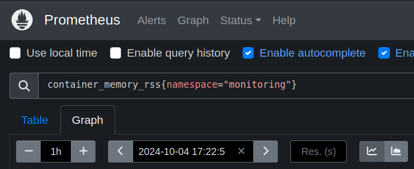

# CRE-2024-009: OpenTelemetry Collector OOM Crash

## Overview

* The OpenTelemetry Collector is a key component in the OpenTelemetry project that acts as a centralized agent or service for collecting, processing, and exporting telemetry data such as traces, metrics, and logs from different applications and systems.

* This exercise will introduce you to collecting and analyzing Jaeger traces with an OpenTelemetry collector. You will learn how to discover and troubleshoot problems with missing Observability data caused by a known issue. And finally, you will learn how to better manage and operate an OpenTelemetry collector at scale.

## Lab

### Step 1: Monitor metrics for OpenTelemetry Collector (1 minute)

Open a browser and load the Prometheus UI. The URL will be http://prometheusXX.classroom.superorbital.io/ (change `XX` to your lab number found on your lab worksheet printout).

Visualize memory usage for the Opentelemetry Collector by viewing a graph of the `container_memory_rss` metric in the `monitoring` namespace.

```
container_memory_rss{namespace="monitoring"}
```



### Step 2: Trigger problem (2 minutes)

Now let's generate traces and send them to the OpenTelemetry Collector. In your terminal, run the following commands:

```
$ cd ./trace_generator
$ ./run.sh
Starting port-forward proxy
Generating traces
Generating 400 total traces using 4 workers...
Forwarding from 127.0.0.1:14268 -> 14268
Forwarding from [::1]:14268 -> 14268
Handling connection for 14268
```

Use Prometheus to monitor the metrics for the OpenTelemetry Collector container in the `monitoring` namespace.

Questions: 

* What do you see happening?
* Why is it happening? What steps would you need to take to figure it out?
* How would we fix it?
* How could you create an alert for this with Prometheus/Alertmanager?

### Step 3: Use Prequel to detect problem (1 minute)

Go to https://app-beta.prequel.dev and log in using your credentials. The credentials are found on your lab worksheet printout.

Click on the new detection.

Explore the detection data and graph.

* What does the detection tell you is happening?
* Are you able to figure out why it might be happening from the log and HTTP data in the detection?
* Where is it coming from?
* Are you able to figure out how to mitigate the problem?

### Step 4: Implement mitigation (10 minutes)

Click on How To Mitigate -> Details

Then edit the OpenTelemetry configuration and apply the recommended Prequel mitigation.

```
$ kubectl -n monitoring edit configmap otel-collector-opentelemetry-collector 
```

Ensure that the `memory_limiter` processor is configured.

```
processors:
  batch: {}
  memory_limiter:
    check_interval: 5s
    limit_percentage: 50
    spike_limit_percentage: 30
```

And make sure that the traces pipeline uses the processor.

```
traces:
  exporters:
  - otlp
  processors:
  - batch
  - memory_limiter
  receivers:
  - jaeger
```

Restart the collector to apply the configuration changes and ensure it started running successfully.

```
$ kubectl -n monitoring rollout restart deployment otel-collector-opentelemetry-collector
$ kubectl -n monitoring get pods
NAME                                                      READY   STATUS    RESTARTS   AGE
otel-collector-opentelemetry-collector-555844884d-hvs7g   1/1     Running   0          34s
```

### Step 5: Trigger problem (2 minutes)

Re-run the instructions in Step 2 to try and re-create the problem.

### Step 6: Monitor memory growth (1 minute)

Use both Prometheus and Prequel to see if the problem happens again.

## Key Takeaways

* All the data in one place
