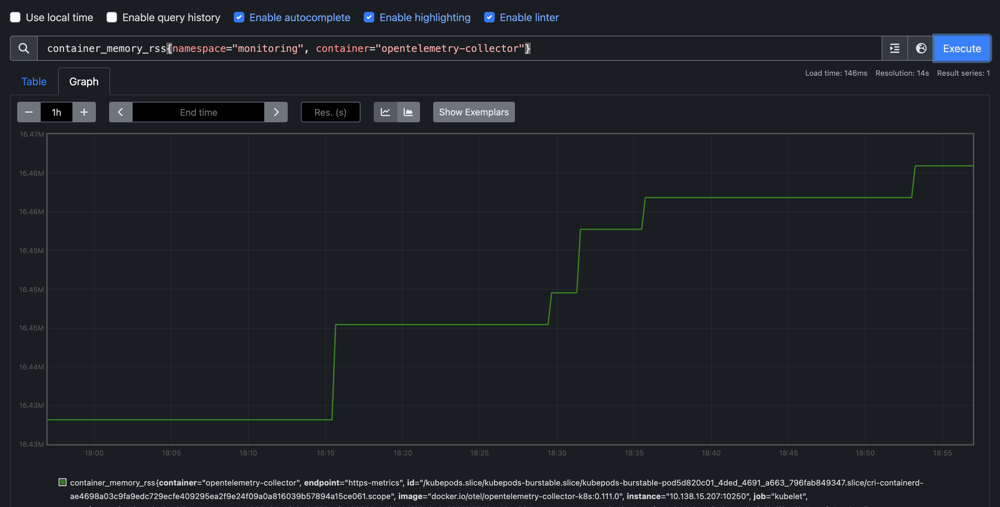

# CRE-2024-009: OpenTelemetry Collector OOM Crash

## Overview

The OpenTelemetry Collector is a key component in the [OpenTelemetry project](https://opentelemetry.io/) that acts as a centralized agent for collecting, processing, and exporting telemetry data such as traces, metrics, and logs from different applications and systems.

This exercise will introduce you to monitoring the OpenTelemetry Collector. You will learn how to discover and troubleshoot problems with the Collector. And you will learn how to better manage and operate an OpenTelemetry collector at scale.

## Common Reliability Enumeration (CRE) 2024-009

Reliability intelligence provides a way to describe known problems with software in a machine readable way. This enables you to automatically detect and mitigate problems in your environment without spending time troubleshooting and researching the problem yourself.

This scenario explores CRE-2024-009, a [known issue](https://github.com/open-telemetry/opentelemetry-collector/discussions/4010) with using the OpenTelemetry Collector.

```
{
    "title": "OpenTelemetry Collector OOM Crash",
    "description": "There is a known problem with the OpenTelemetry Collector where the collector can crash due to an out-of-memory (OOM) condition. This can cause the collector to stop processing telemetry data and can lead to gaps in the collected data. This can cause the collector to become unresponsive and can lead to liveness probe failures and restarts of the OpenTelemetry Collector.",
    "type": "memory problems",
    "severity": "critical",
    "metrics": "container_memory_rss",
    "symptoms": [
        "liveness/readiness probe timeouts",
        "most of the memory is coming from ingested OTLP data"
    ],
    "reports": 2,
    "applications": [
        {
            "application": "opentelemetry-collector",
            "versions": [
                "0.104.0",
                "0.105.0",
                "0.106.0",
                "0.107.0",
                "0.108.0",
                "0.109.0",
                "0.110.0",
                "0.111.0"
            ]
        }
    ],
    "cause": "backpressure exporting OTLP data to upstream destinations",
    "solutions": [
        "Use the memory_limiter processor"
    ],
    "tags": [
        "OpenTelemetry",
        "crash",
        "memory"
    ],
    "detections": [
        {
            "query language": "Prequel",
            "rule": "k8(image_url=\"docker.io/otel/opentelemetry-collector*\", event=OOMKilling)"
        }
    ],
    "references": [
        "https://github.com/open-telemetry/opentelemetry-collector/discussions/4010"
    ]
}
```

## Lab (about 20 minutes)

### Step 1: Monitor metrics for OpenTelemetry Collector (1 minute)

Open a browser and load the Prometheus UI. The URL will be http://prometheusXX.classroom.superorbital.io/ (change `XX` to your lab number found on your lab worksheet printout).

Visualize memory usage for the Opentelemetry Collector by viewing a graph of the `container_memory_rss` metric in the `monitoring` namespace.

```
container_memory_rss{namespace="monitoring", container="opentelemetry-collector"}
```



The metric `container_memory_rss` measures the Resident Set Size (RSS), which is the amount of memory that a container has in RAM. Specifically, it shows the non-swapped physical memory used by the container, which is a critical indicator of how much memory the container is actively using from the available RAM. Memory resource limits measure RSS usage to determine whether a Kubernetes resource has exceeded its limit.

This metric is useful for monitoring memory usage trends and potential memory pressure.

### Step 2: Trigger problem (2 minutes)

Now let's generate traces and send them to the OpenTelemetry Collector. In your terminal, run the following commands:

Ensure you are in the scenario folder:

```bash
$ pwd
/home/student/prequel/workshop/scenarios/scenario-01-cre-2024-009
```

```bash
$ cd ./trace_generator/k8s
$ kubectl -n monitoring apply -f ./deploy.yaml
deployment.apps/traces-generator-deployment created
$ kubectl -n monitoring logs deployments/traces-generator-deployment -f 
Using collector address: otel-collector-opentelemetry-collector.monitoring.svc.cluster.local:14268
Generating 400 total traces using 4 workers...
2024/10/07 18:38:23 Post "http://otel-collector-opentelemetry-collector.monitoring.svc.cluster.local:14268/api/traces": EOF
2024/10/07 18:38:27 Post "http://otel-collector-opentelemetry-collector.monitoring.svc.cluster.local:14268/api/traces": dial tcp 10.119.252.93:14268: connect: connection refused
```

This may take a few minutes to complete. Delete the deployment when you see the above EOF and connection refused errors.

```bash
$ k -n monitoring delete deployments.apps traces-generator-deployment 
deployment.apps "traces-generator-deployment" deleted
```

Use Prometheus to monitor the metrics for the OpenTelemetry Collector container in the `monitoring` namespace.

**Questions:** 

* What do you see happening in Prometheus?
* Why is it happening? What steps would you need to take to figure it out?
* How would we fix it?
* How could you create an alert for this with Prometheus/Alertmanager?

**Hints:** 

Suggested metrics to explore:

```bash
container_oom_events_total{namespace="monitoring", image="docker.io/otel/opentelemetry-collector-k8s:0.111.0"}
```

```bash
kube_pod_container_status_last_terminated_reason{namespace="monitoring", container="opentelemetry-collector"}
```

### Step 3: Use Prequel to detect problem (1 minute)

Go to https://app-beta.prequel.dev and log in using your credentials. The credentials are found on your lab worksheet printout.

Click on the most recent detection and explore the detection data and graph.

**Questions:**

* What does the detection tell you is happening?
* Are you able to figure out why it might be happening from the log and HTTP data in the detection?
* Where is it coming from based on the graph?
* Are you able to figure out how to mitigate the problem?
* What is different about the detection logic?

```bash
k8(image_url="docker.io/otel/opentelemetry-collector*", event=OOMKilled)
```

#### Problem Explanation

Note the following log lines in the OpenTelemetry Collector:

```bash
$ kubectl -n monitoring logs deployments/otel-collector-opentelemetry-collector
2024-10-09T17:13:08.563Z	warn	grpc@v1.67.1/clientconn.go:1379	[core] [Channel #1 SubChannel #8]grpc: addrConn.createTransport failed to connect to {Addr: "127.0.0.1:4319", ServerName: "localhost:4319", }. Err: connection error: desc = "transport: Error while dialing: dial tcp 127.0.0.1:4319: connect: connection refused"	{"grpc_log": true}
2024-10-09T17:13:08.563Z	warn	grpc@v1.67.1/clientconn.go:1379	[core] [Channel #1 SubChannel #8]grpc: addrConn.createTransport failed to connect to {Addr: "[::1]:4319", ServerName: "localhost:4319", }. Err: connection error: desc = "transport: Error while dialing: dial tcp [::1]:4319: connect: cannot assign requested address"	{"grpc_log": true}
2024-10-09T17:13:10.510Z	info	internal/retry_sender.go:118	Exporting failed. Will retry the request after interval.	{"kind": "exporter", "data_type": "traces", "name": "otlp", "error": "rpc error: code = Unavailable desc = connection error: desc = \"transport: Error while dialing: dial tcp 127.0.0.1:4319: connect: connection refused\"", "interval": "15.940329642s"}
2024-10-09T17:13:12.954Z	info	internal/retry_sender.go:118	Exporting failed. Will retry the request after interval.	{"kind": "exporter", "data_type": "traces", "name": "otlp", "error": "rpc error: code = Unavailable desc = connection error: desc = \"transport: Error while dialing: dial tcp 127.0.0.1:4319: connect: connection refused\"", "interval": "42.666106117s"}
2024-10-09T17:13:13.541Z	info	internal/retry_sender.go:118	Exporting failed. Will retry the request after interval.	{"kind": "exporter", "data_type": "traces", "name": "otlp", "error": "rpc error: code = Unavailable desc = connection error: desc = \"transport: Error while dialing: dial tcp 127.0.0.1:4319: connect: connection refused\"", "interval": "16.483723636s"}
2024-10-09T17:13:15.232Z	info	internal/retry_sender.go:118	Exporting failed. Will retry the request after interval.	{"kind": "exporter", "data_type": "traces", "name": "otlp", "error": "rpc error: code = Unavailable desc = connection error: desc = \"transport: Error while dialing: dial tcp 127.0.0.1:4319: connect: connection refused\"", "interval": "20.515484291s"}
2024-10-09T17:13:15.660Z	info	internal/retry_sender.go:118	Exporting failed. Will retry the request after interval.	{"kind": "exporter", "data_type": "traces", "name": "otlp", "error": "rpc error: code = Unavailable desc = connection error: desc = \"transport: Error while dialing: dial tcp 127.0.0.1:4319: connect: connection refused\"", "interval": "14.58537921s"}
2024-10-09T17:13:19.846Z	info	internal/retry_sender.go:118	Exporting failed. Will retry the request after interval.	{"kind": "exporter", "data_type": "traces", "name": "otlp", "error": "rpc error: code = Unavailable desc = connection error: desc = \"transport: Error while dialing: dial tcp 127.0.0.1:4319: connect: connection refused\"", "interval": "17.095877718s"}
2024-10-09T17:13:20.086Z	info	internal/retry_sender.go:118	Exporting failed. Will retry the request after interval.	{"kind": "exporter", "data_type": "traces", "name": "otlp", "error": "rpc error: code = Unavailable desc = connection error: desc = \"transport: Error while dialing: dial tcp 127.0.0.1:4319: connect: connection refused\"", "interval": "31.629400874s"}
2024-10-09T17:13:21.504Z	info	internal/retry_sender.go:118	Exporting failed. Will retry the request after interval.	{"kind": "exporter", "data_type": "traces", "name": "otlp", "error": "rpc error: code = Unavailable desc = connection error: desc = \"transport: Error while dialing: dial tcp 127.0.0.1:4319: connect: connection refused\"", "interval": "16.520110222s"}
```

The OpenTelemetry Collector receives traces from your cluster and forwards it on to a destination source, such as Prometheus. The logs above indicate that the collector is unable to forward the data it is receiving. This data builds up in the collector's memory, eventually consuming more than its resource limit. When this resource limit is exceeded, the container is terminated by Linux. This container status event shows up in Kuberetes as an `OOMKilling` event.

### Step 4: Implement mitigation (10 minutes)

Click on How To Mitigate -> Details. Then edit the OpenTelemetry configuration and apply the recommended Prequel mitigation.

```
$ kubectl -n monitoring edit configmap otel-collector-opentelemetry-collector 
```

Ensure that the `memory_limiter` processor is configured.

```bash
processors:
  batch: {}
  memory_limiter:
    check_interval: 5s
    limit_percentage: 50
    spike_limit_percentage: 30
```

And make sure that the traces pipeline uses the processor.

```bash
traces:
  exporters:
  - otlp
  processors:
  - batch
  - memory_limiter
  receivers:
  - jaeger
```

Restart the collector to apply the configuration changes and ensure it started running successfully.

```bash
$ kubectl -n monitoring rollout restart deployment otel-collector-opentelemetry-collector
$ kubectl -n monitoring get pods
NAME                                                      READY   STATUS    RESTARTS   AGE
otel-collector-opentelemetry-collector-555844884d-hvs7g   1/1     Running   0          34s
```

### Step 5: Trigger problem (2 minutes)

Re-run the instructions in Step 2 to try and re-create the problem.

### Step 6: Monitor memory growth (1 minute)

Use both Prometheus and Prequel to see if the problem happens again.

## Key Takeaways

* The OpenTelemetry Collector `memory_limiter` processor is an important pipeline component, especially in larger scale environments
* Reliability research and intelligence can reduce the time to monitor, understand, and mitigate problems
* Wildcard support for fields like `image_urls` can reduce the number of rules required to detect problems
* Visualizing service graphs in the context of a specific detection can help further identify contributing factors to an ongoing problem
