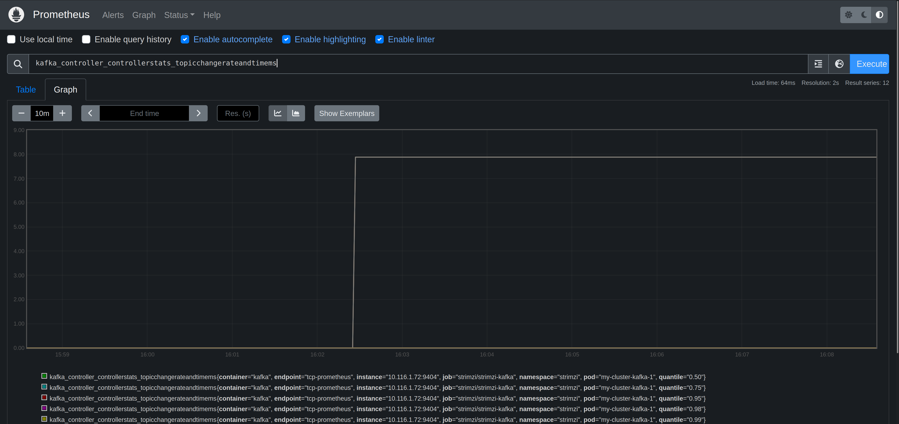

# CRE-2024-006: Kafka Topic Operator Thread Blocked

## Overview

[Apache Kafka](https://kafka.apache.org/) is an open-source distributed event streaming platform primarily used for building real-time data pipelines and streaming applications. It was originally developed by LinkedIn and is now maintained by the Apache Software Foundation.

This exercise will introduce you to creating and using Kafka topics. You will learn how to discover and troubleshoot a [known problem](https://github.com/strimzi/strimzi-kafka-operator/issues/6046) with Kafka.

## Common Relability Enumeration (CRE) 2024-009

Reliability intelligence provides a way to describe known problems with software in a machine readiable way. This enables you to automatically detect and mitigate problems in your environment without spending troubleshooting and researching the problem yourself.

This scenario explores CRE-2024-006, a [known issue](https://github.com/strimzi/strimzi-kafka-operator/issues/6046) with using the Strimzi Kafka topic operator.

```
{
    "title": "Strimzi Kafka Topic Operator Thread Blocked",
    "description": "There is a known issue in the Strimzi Kafka Topic Operator where the operator thread can become blocked. This can cause the operator to stop processing events and can lead to a backlog of events. This can cause the operator to become unresponsive and can lead to liveness probe failures and restarts of the Strimzi Kafka Topic Operator.",
    "type": "message-queue-problems",
    "severity": "critical",
    "metrics": "",
    "symptoms": [
        "blocked threads"
    ],
    "reports": 1,
    "applications": [
        {
            "application": "Strimzi kafka"
        }
    ],
    "cause": "CPU limitations",
    "solutions": [
        "Use the Zookeeper store instead of the Kafka Streams store for the Strimzi Kafka Topic Operator"
    ],
    "tags": [
        "kafka",
        "threads",
        "strimzi"
    ],
    "detections": [
        {
            "query language": "Prequel",
            "rule": "k8(container_name=\"topic-operator\", event=STARTUP) | log( pattern=\"io.vertx.core.VertxException: Thread blocked\", window=90s)"
        }
    ],
    "references": [
        "[https://github.com/strimzi/strimzi-kafka-operator/issues/6046](https://github.com/strimzi/strimzi-kafka-operator/issues/6046)"
    ]
}
```

## Lab (about 20 minutes)

### Step 1: Add a new Kafka topic (5 minutes)

This lab exercise uses [Strimzi Kafka for Kubernetes](https://strimzi.io/). Strimzi provides a way to run an Apache Kafka cluster on Kubernetes in various deployment configurations. 

Let's discover how to add new Kafka topics. Kafka topics are the categories used to organize messages. Each topic has a name that is unique across the entire Kafka cluster. Messages are sent to and read from specific topics. Producers write data to topics and consumers read data from topics. 

We can get a list of current topics by enumerating the `kafkatopics.kafka.stirmzi.io` CRD.

```bash
$ kubectl -n strimzi get kafkatopics.kafka.strimzi.io 
NAME                                                                                               CLUSTER      PARTITIONS   REPLICATION FACTOR   READY
consumer-offsets---84e7a678d08f4bd226872e5cdd4eb527fadc1c6a                                        my-cluster   50           2                    True
strimzi-store-topic---effb8e3e057afce1ecf67c3f5d8e4e3ff177fc55                                     my-cluster   1            2                    True
strimzi-topic-operator-kstreams-topic-store-changelog---b75e702040b99be8a9263134de3507fc0cc4017b   my-cluster   1            2                    True
```

The Strimzi Kafka [entity operator](https://strimzi.io/docs/operators/0.28.0/full/configuring#assembly-kafka-entity-operator-str) contains a user and topic operator. The operators are automatically configured to monitor and manage the topics and users of the Kafka cluster.

Add a new topic by applying the `topic-00.yaml` configuration file. 

```bash
$ kubectl -n strimzi apply -f ./topic-00.yaml 
kafkatopic.kafka.strimzi.io/topic-00 configured
```

After a few minutes you should see that the new topic `topic-00` is ready.

```bash
$ kubectl -n strimzi get kafkatopics.kafka.strimzi.io 
NAME                                                                                               CLUSTER      PARTITIONS   REPLICATION FACTOR   READY
consumer-offsets---84e7a678d08f4bd226872e5cdd4eb527fadc1c6a                                        my-cluster   50           2                    True
strimzi-store-topic---effb8e3e057afce1ecf67c3f5d8e4e3ff177fc55                                     my-cluster   1            2                    True
strimzi-topic-operator-kstreams-topic-store-changelog---b75e702040b99be8a9263134de3507fc0cc4017b   my-cluster   1            2                    True
topic-00                                                                                           my-cluster   3            1                    True
```

### Step 2: Monitor metrics for Kafka (1 minutes)

Open a browser and load the Prometheus UI. The URL will be http://prometheusXX.classroom.superorbital.io/ (change `XX` to your lab number found on your lab worksheet printout).

Visualize metrics for Kafka by viewing a graph of the following metrics:

```
kafka_controller_controllerstats_topicchangerateandtimems_count
```



Question:

* What other Kafka metrics might be important to monitor the health of Kafka topic creation?

### Step 3: Trigger problem (5 minutes)

Now let's recreate the problem associated with CRE-2024-006.

```bash
$ kubectl -n strimzi apply -f ./kafka-metrics-01.yaml
```

Monitor Kubernetes events to wait until the entity operator is successfully re-created.

```bash
$ kubectl -n strimzi get events -w -A | grep SuccessfulCreate
strimzi      0s          Normal    SuccessfulCreate    replicaset/my-cluster-entity-operator-67cb786575   Created pod: my-cluster-entity-operator-67cb786575-46888
```

Now create a new topic.

```bash
$ kubectl -n strimzi apply -f ./topic-01.yaml 
kafkatopic.kafka.strimzi.io/topic-01 configured
```

Watch the `kafkatopics.kafka.strimzi.io` resources.

```bash
$ kubectl -n strimzi get kafkatopics.kafka.strimzi.io -w
NAME                                                                                               CLUSTER      PARTITIONS   REPLICATION FACTOR   READY
consumer-offsets---84e7a678d08f4bd226872e5cdd4eb527fadc1c6a                                        my-cluster   50           2                    True
strimzi-store-topic---effb8e3e057afce1ecf67c3f5d8e4e3ff177fc55                                     my-cluster   1            2                    True
strimzi-topic-operator-kstreams-topic-store-changelog---b75e702040b99be8a9263134de3507fc0cc4017b   my-cluster   1            2                    True
topic-00                                                                                           my-cluster   3            1                    True
topic-01                                                                                           my-cluster   3            1                    
```

Questions: 

* What do you observe with the new topic?
* What metrics can you monitor in Prometheus to see what is happening?
* Why is it happening? What steps would you need to take to figure it out?
* How would we fix it?
* How could you create an alert for this with Prometheus/Alertmanager?

### Step 4: Use Prequel to detect problem (1 minute)

Go to https://app-beta.prequel.dev and log in using your credentials. The credentials are found on your lab worksheet printout.

Click on the most recent detection and explore the detection data.

Questions:

* What does the detection tell you is happening?
* Are you able to figure out why it might be happening from the log data in the detection?
* Are you able to figure out how to mitigate the problem?

### Step 5: Implement mitigation (2 minutes)

Click on How To Mitigate -> Details

What are the recommended changes to fix this problem?

Use `diff -y` to see the changes before applying them.

```bash
$ diff -y kafka-metrics-01.yaml kafka-metrics-00.yaml
  entityOperator:						                          entityOperator:
    template:							                              template:
      topicOperatorContainer:					                    topicOperatorContainer:
        env:							                                  env:
        - name: STRIMZI_USE_ZOOKEEPER_TOPIC_STORE           - name: STRIMZI_USE_ZOOKEEPER_TOPIC_STORE
          value: "false"				                    |	        value: "true"
    topicOperator:						                          topicOperator:
							                                      >	    startupProbe:
							                                      >	      initialDelaySeconds: 60
							                                      >	      timeoutSeconds: 5 
      resources:						                              resources:
        limits:							                                limits:
          cpu: 60m					                        |	        cpu: 500m
          memory: 540Mi						                            memory: 540Mi
        requests:						                                requests:
          cpu: 20m					                        |	        cpu: 100m
          memory: 300Mi						                            memory: 300Mi
```

Apply the recommended Prequel mitigation.

```bash
$ kubectl -n strimzi apply -f ./kafka-metrics-01.yaml
```

### Step 6: Trigger problem (2 minutes)

Now check the topics to see if the new topic is created.

```bash
$ kubectl -n strimzi get kafkatopics.kafka.strimzi.io -w
NAME                                                                                               CLUSTER      PARTITIONS   REPLICATION FACTOR   READY
consumer-offsets---84e7a678d08f4bd226872e5cdd4eb527fadc1c6a                                        my-cluster   50           2                    True
strimzi-store-topic---effb8e3e057afce1ecf67c3f5d8e4e3ff177fc55                                     my-cluster   1            2                    True
strimzi-topic-operator-kstreams-topic-store-changelog---b75e702040b99be8a9263134de3507fc0cc4017b   my-cluster   1            2                    True
topic-00                                                                                           my-cluster   3            1                    True
topic-01                                                                                           my-cluster   3            1                    True
```

## Key Takeaways

* All the data in one place
