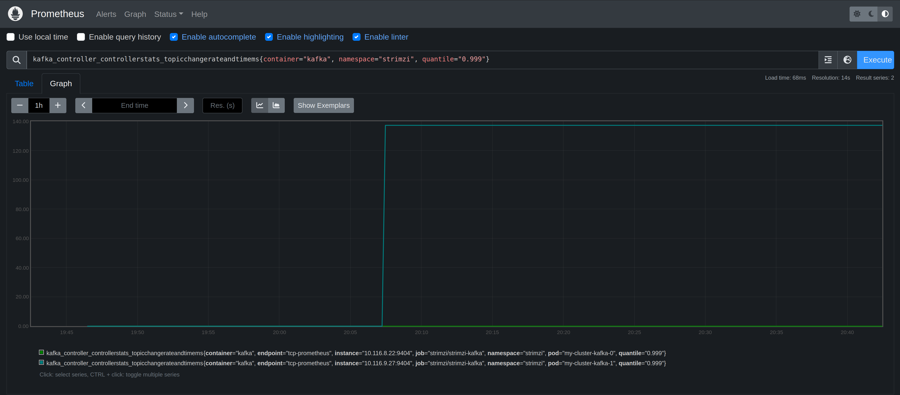

# CRE-2024-006: Kafka Topic Operator Thread Blocked

## Overview

[Apache Kafka](https://kafka.apache.org/) is an open-source distributed event streaming platform primarily used for building real-time data pipelines and streaming applications. It was originally developed by LinkedIn and is now maintained by the Apache Software Foundation.

This exercise will introduce you to creating and using Kafka topics. You will learn how to discover and troubleshoot a [known problem](https://github.com/strimzi/strimzi-kafka-operator/issues/6046) with Kafka.

## Common Relability Enumeration (CRE) 2024-009

Reliability intelligence provides a way to describe known problems with software in a machine readable way. This enables you to automatically detect and mitigate problems in your environment without spending time troubleshooting and researching the problem yourself.

This scenario explores CRE-2024-006, a [known issue](https://github.com/strimzi/strimzi-kafka-operator/issues/6046) with the Strimzi Kafka topic operator.

```
{
    "title": "Strimzi Kafka Topic Operator Thread Blocked",
    "description": "There is a known issue in the Strimzi Kafka Topic Operator where the operator thread can become blocked. This can cause the operator to stop processing events and can lead to a backlog of events. This can cause the operator to become unresponsive and can lead to liveness probe failures and restarts of the Strimzi Kafka Topic Operator.",
    "type": "message-queue-problems",
    "severity": "critical",
    "metrics": "",
    "symptoms": [
        "blocked threads"
    ],
    "reports": 1,
    "applications": [
        {
            "application": "Strimzi kafka"
        }
    ],
    "cause": "CPU limitations",
    "solutions": [
        "Use the Zookeeper store instead of the Kafka Streams store for the Strimzi Kafka Topic Operator"
    ],
    "tags": [
        "kafka",
        "threads",
        "strimzi"
    ],
    "detections": [
        {
            "query language": "Prequel",
            "rule": "k8(container_name=\"topic-operator\", event=STARTUP) | log( pattern=\"io.vertx.core.VertxException: Thread blocked\", window=90s)"
        }
    ],
    "references": [
        "[https://github.com/strimzi/strimzi-kafka-operator/issues/6046](https://github.com/strimzi/strimzi-kafka-operator/issues/6046)"
    ]
}
```

## Lab (about 20 minutes)

### Step 1: Add a new Kafka topic (5 minutes)

This lab exercise uses [Strimzi Kafka for Kubernetes](https://strimzi.io/). Strimzi provides a way to run an Apache Kafka cluster on Kubernetes in various deployment configurations. 

Let's discover how to add new Kafka topics. Kafka topics are the categories used to organize messages. Each topic has a name that is unique across the entire Kafka cluster. Messages are sent to and read from specific topics. Producers write data to topics and consumers read data from topics. 

The Strimzi Kafka [entity operator](https://strimzi.io/docs/operators/0.28.0/full/configuring#assembly-kafka-entity-operator-str) is used to manage Kafka-related entities in a running Kafka cluster. It contains a user and topic operator. The operators are automatically configured to monitor and manage the topics and users of the Kafka cluster.

Add a new topic by applying the `topic-00.yaml` configuration file. 

```bash
$ kubectl -n strimzi apply -f ./topic-00.yaml 
kafkatopic.kafka.strimzi.io/topic-00 created
```

After a few minutes you should see that the new topic `topic-00` is ready.

```bash
$ kubectl -n strimzi get kafkatopics.kafka.strimzi.io 
NAME                                                                                               CLUSTER      PARTITIONS   REPLICATION FACTOR   READY
topic-00                                                                                           my-cluster   3            1                    True
```

### Step 2: Monitor metrics for Kafka (1 minutes)

Open a browser and load the Prometheus UI. The URL will be http://prometheusXX.classroom.superorbital.io/ (change `XX` to your lab number found on your lab worksheet printout).

Use Prometheus to visualize the health of Kafka topic creation using the following metric:

```
kafka_controller_controllerstats_topicchangerateandtimems{container="kafka", namespace="strimzi", quantile="0.999"}
```



The Kafka metric `kafka_controller_controllerstats_topicchangerateandtimems` is a controller-level metric that measures the rate and time taken for changes related to Kafka topics. It captures two key pieces of information:

1. Topic Change Rate: This part of the metric tracks how frequently changes to Kafka topics occur. Topic changes could include operations such as creating, deleting, or altering a topic's configuration or partition structure.

2. Topic Change Time (in milliseconds): This part tracks the time taken for the controller to process these topic changes, measured in milliseconds. It reflects how long the Kafka controller takes to detect and apply these changes.

This metric is useful for monitoring the responsiveness of the Kafka controller to topic-related changes and understanding the load that topic modifications place on the system. High change rates or long processing times could indicate bottlenecks or performance issues in the Kafka controller.

The 0.999 quantile means that 99.9% of the time, topic changes take less than or equal to the value reported by this metric.

You can explore additional Kafka metrics by typing `kafka_` in the search bar and reviewing the list of metrics. Or you can use the Metrics Explorer interface next to the Execute button.

Question:

* What other Kafka metrics might be important to monitor the health of Kafka topic creation?

### Step 3: Trigger problem (10 minutes)

Now let's recreate the problem associated with CRE-2024-006.

```bash
$ kubectl -n strimzi apply -f ./kafka-metrics-01.yaml
kafka.kafka.strimzi.io/my-cluster configured
configmap/kafka-metrics unchanged
```

Monitor Kubernetes events to wait until the entity operator is successfully re-created. This can take a few minutes for the Strimzi Kafka operator to reconcile the configuration change. 

```bash
$ kubectl -n strimzi get events -w -A | grep SuccessfulCreate
strimzi      0s          Normal    SuccessfulCreate    replicaset/my-cluster-entity-operator-67cb786575   Created pod: my-cluster-entity-operator-67cb786575-46888
```

Now create another topic.

```bash
$ kubectl -n strimzi apply -f ./topic-01.yaml 
kafkatopic.kafka.strimzi.io/topic-01 configured
```

Watch the `kafkatopics.kafka.strimzi.io` resources.

```bash
$ kubectl -n strimzi get kafkatopics.kafka.strimzi.io -w
NAME                                                                                               CLUSTER      PARTITIONS   REPLICATION FACTOR   READY
topic-00                                                                                           my-cluster   3            1                    True
topic-01                                                                                           my-cluster   3            1                    
```

Questions: 

* What do you observe with the new topic? Does it get created? Why or why not?
* Does the `kafka_controller_controllerstats_topicchangerateandtimems` metric in Prometheus help you understand what is happening?
* Why isn't the new topic being created? What steps would you need to take to figure this out?
* How would we fix it?
* What other metrics can we explore to help monitor this problem? Do any of the `vertx*` metrics help?
* How could you create an alert for this with Prometheus/Alertmanager?

### Step 4: Use Prequel to detect problem (1 minute)

Go to https://app-beta.prequel.dev and log in using your credentials. The credentials are found on your lab worksheet printout.

Click on the most recent detection and explore the detection data.

Questions:

* What does the detection tell you is happening?
* Are you able to figure out why it might be happening from the log data in the detection?
* Are you able to figure out how to mitigate the problem?
* What are the differences between an Alertmanager rule for this problem and a reliability intelligence detection?

```bash
k8(container_name="topic-operator", event=STARTUP) | log(pattern="io.vertx.core.VertxException: Thread blocked", window=90s)
```

### Step 5: Implement mitigation (2 minutes)

Click on How To Mitigate -> Details. What are the recommended changes to fix this problem?

Use `diff -y` to see the changes before applying them.

```bash
$ diff -y kafka-metrics-01.yaml kafka-metrics-00.yaml
  entityOperator:						                          entityOperator:
    template:							                              template:
      topicOperatorContainer:					                    topicOperatorContainer:
        env:							                                  env:
        - name: STRIMZI_USE_ZOOKEEPER_TOPIC_STORE           - name: STRIMZI_USE_ZOOKEEPER_TOPIC_STORE
          value: "false"				                    |	        value: "true"
    topicOperator:						                          topicOperator:
							                                      >	    startupProbe:
							                                      >	      initialDelaySeconds: 60
							                                      >	      timeoutSeconds: 5 
      resources:						                              resources:
        limits:							                                limits:
          cpu: 60m					                        |	        cpu: 500m
          memory: 540Mi						                            memory: 540Mi
        requests:						                                requests:
          cpu: 20m					                        |	        cpu: 100m
          memory: 300Mi						                            memory: 300Mi
```

Apply the recommended Prequel mitigation.

```bash
$ kubectl -n strimzi apply -f ./kafka-metrics-00.yaml
```

Watch the `kafkatopics.kafka.strimzi.io` resources to ensure the new topic is created.

```bash
$ kubectl -n strimzi get kafkatopics.kafka.strimzi.io -w
NAME                                                                                               CLUSTER      PARTITIONS   REPLICATION FACTOR   READY
topic-00                                                                                           my-cluster   3            1                    True
topic-01                                                                                           my-cluster   3            1                    True
```

## Key Takeaways

* Reliability problems can be challenging to detect using just metrics
* Creating detections that join data across metrics, events, and logs can enable the creation of detections with low signal-to-noise ratios
* Relability intelligence can reduce the time to learn about known failure
