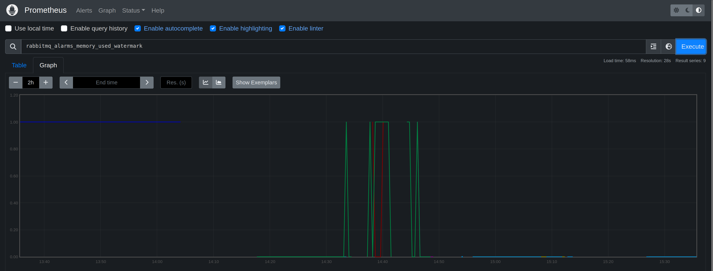
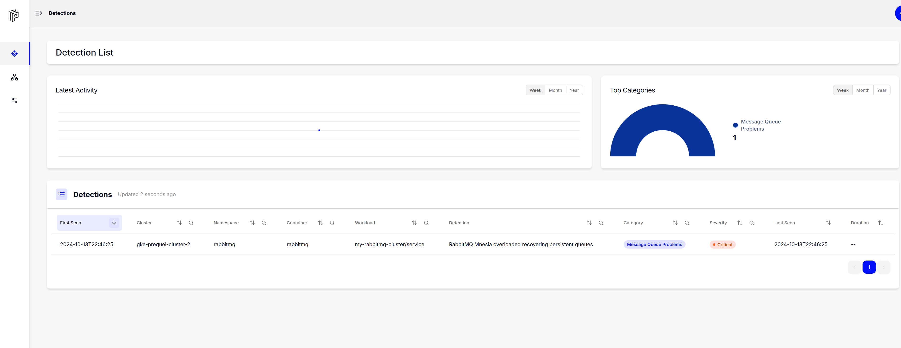
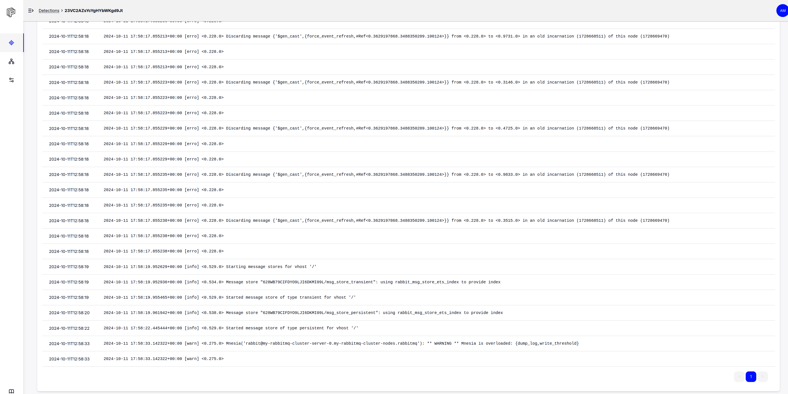
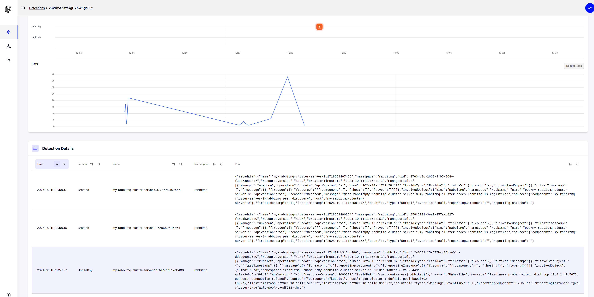
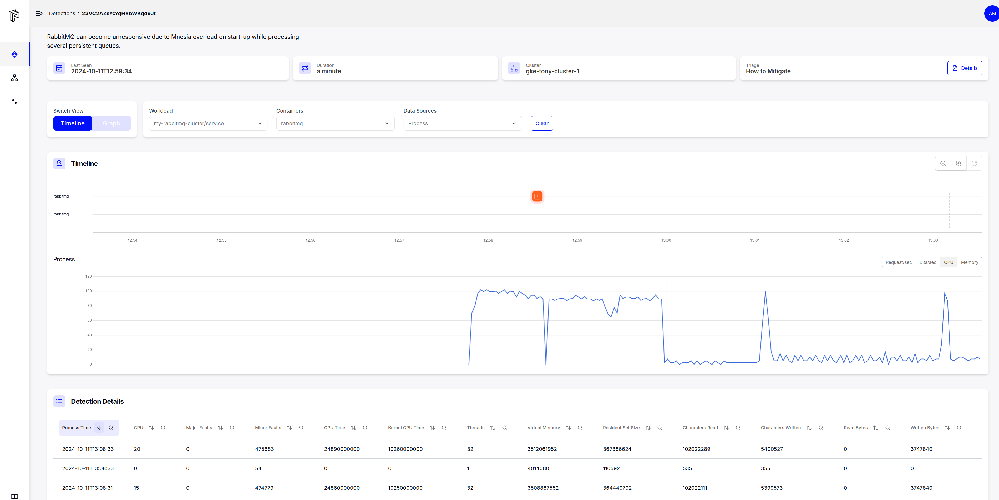

# CRE-2024-007: RabbitMQ Mnesia overloaded 

## Overview

You are an SRE at a fast-growing fintech company. Your responsibilities include monitoring all layers of the application and putting the appropriate observability tooling in place. The tool of choice is the Grafana/Prometheus stack.

[RabbitMQ](https://www.rabbitmq.com/) is a messaging system that allows different parts of a software application to communicate with each other by sending and receiving messages. Think of it as a postal service within a software system where messages (letters) are sent to queues (mailboxes), and other parts of the system can retrieve those messages when they're ready.

It's your job to make sure all elements of your application - including RabbitMQ and healthy. 

## Lab (about 20 minutes)

### Step 1: Monitor metrics for RabbitMQ (1 minutes)

Open a browser and load the Prometheus UI. The URL will be http://prometheusXX.classroom.superorbital.io/ (change `XX` to your lab number found on your lab worksheet printout).

Use Prometheus to visualize and explore RabbitMQ metrics. Let's start with:

```
rabbitmq_alarms_memory_used_watermark{namespace="rabbitmq"}
```



What does this metric measure?

Just like any other application, RabbitMQ uses memory (RAM) to perform its operations. It stores messages in memory, especially when they are waiting in queues to be processed. However, memory is a limited resource, and if RabbitMQ uses too much memory, it can negatively impact the overall system performance or even cause the system to run out of memory.

To prevent using too much memory, RabbitMQ has a safety mechanism called the memory watermark. This is similar to setting a limit on how much water can fill a tank to prevent overflow. It's a predefined threshold (limit) of memory usage. When RabbitMQ's memory usage reaches this threshold, it takes action to prevent further memory consumption.

The `rabbitmq_alarms_memory_used_watermark` indicates when RabbitMQ has entered this alarm state and, as a result, will stop processing all new messages.

You can explore additional RabbitMQ metrics by typing `rabbitmq` in the search bar and reviewing the list of metrics. Or you can use the Metrics Explorer interface next to the Execute button.

#### Question 1: What other RabbitMQ metrics might be important to monitor? 

```bash
rabbitmq_queue_messages_unacked{namespace="monitoring"}
```

This metric measures the number of unacknowledged messages from consumers of your RabbitMQ queues. If this grows unbounded, then it could signal a performance issue in your services that use RabbitMQ to consume messages.

```bash
rabbitmq_alarms_file_descriptor_limit{namespace="monitoring"}
```

This metric is another alarm that signals when RabbitMQ has run out of file descriptor resources and can no longer process any persistent queues.

### Step 3: Trigger problem (10 minutes)

You should already have an SSH session open to the workshop environment. In your terminal, run the following commands:

Now let's recreate the problem associated with CRE-2024-007. This will take about 2 minutes.

Change directories to the relevant scenario folder:

```bash
$ cd /home/studentXX/workshop/scenarios/scenario-03-cre-2024-007/
$ pwd
/home/studentXX/workshop/scenarios/scenario-03-cre-2024-007
```

Run the `trigger.sh` script to trigger the scenario problem. 

This script will create a Kubernetes job that generates messages and sends them to RabbitMQ. It takes a few minutes to complete.


```bash
$ time ./trigger.sh 
Error from server (NotFound): jobs.batch "messages-generator-job" not found
Deploying the problem trigger job...
job.batch/messages-generator-job created
Waiting for the Job 'messages-generator-job' to complete...
Job 'messages-generator-job' is still running. Checking again in 5 seconds...
Job 'messages-generator-job' is still running. Checking again in 5 seconds...
Job 'messages-generator-job' is still running. Checking again in 5 seconds...
Job 'messages-generator-job' is still running. Checking again in 5 seconds...
Job 'messages-generator-job' is still running. Checking again in 5 seconds...
Job 'messages-generator-job' is still running. Checking again in 5 seconds...
Job 'messages-generator-job' is still running. Checking again in 5 seconds...
Job 'messages-generator-job' is still running. Checking again in 5 seconds...
Job 'messages-generator-job' is still running. Checking again in 5 seconds...
Job 'messages-generator-job' is still running. Checking again in 5 seconds...
Job 'messages-generator-job' is still running. Checking again in 5 seconds...
Job 'messages-generator-job' is still running. Checking again in 5 seconds...
Job 'messages-generator-job' is still running. Checking again in 5 seconds...
Job 'messages-generator-job' is still running. Checking again in 5 seconds...
Job 'messages-generator-job' is still running. Checking again in 5 seconds...
Job 'messages-generator-job' is still running. Checking again in 5 seconds...
Job 'messages-generator-job' is still running. Checking again in 5 seconds...
Job 'messages-generator-job' completed at 2024-10-09T02:34:42Z.
Warning: Immediate deletion does not wait for confirmation that the running resource has been terminated. The resource may continue to run on the cluster indefinitely.
pod "my-rabbitmq-cluster-server-0" force deleted
pod "my-rabbitmq-cluster-server-1" force deleted
job.batch "messages-generator-job" deleted
Trigger completed

real	1m32.636s
user	0m6.234s
sys	0m0.995s
```

#### Question 1: What seems to be happening to your RabbitMQ cluster?

Take a look at your RabbitMQ metrics in Prometheus. 

Let's also look through the RabbitMQ logs to see what is happening.

First, search for warnings.

```bash
$ kubectl -n rabbitmq logs my-rabbitmq-cluster-server-0 | grep -i warning
Defaulted container "rabbitmq" out of: rabbitmq, setup-container (init)
2024-10-11 17:58:33.142322+00:00 [warn] <0.275.0> Mnesia('rabbit@my-rabbitmq-cluster-server-0.my-rabbitmq-cluster-nodes.rabbitmq'): ** WARNING ** Mnesia is overloaded: {dump_log,write_threshold}
2024-10-11 17:59:30.545072+00:00 [warn] <0.275.0> Mnesia('rabbit@my-rabbitmq-cluster-server-0.my-rabbitmq-cluster-nodes.rabbitmq'): ** WARNING ** Mnesia is overloaded: {dump_log,write_threshold}
2024-10-11 17:59:35.343702+00:00 [warn] <0.275.0> Mnesia('rabbit@my-rabbitmq-cluster-server-0.my-rabbitmq-cluster-nodes.rabbitmq'): ** WARNING ** Mnesia is overloaded: {dump_log,write_threshold}
```

Now look for errors.

```bash
kubectl -n rabbitmq logs my-rabbitmq-cluster-server-0 | grep -i 'erro'
Defaulted container "rabbitmq" out of: rabbitmq, setup-container (init)
2024-10-11 17:58:12.343343+00:00 [erro] <0.275.0> Mnesia('rabbit@my-rabbitmq-cluster-server-0.my-rabbitmq-cluster-nodes.rabbitmq'): ** ERROR ** mnesia_event got {inconsistent_database, starting_partitioned_network, 'rabbit@my-rabbitmq-cluster-server-1.my-rabbitmq-cluster-nodes.rabbitmq'}
2024-10-11 17:58:12.343343+00:00 [erro] <0.275.0> 
2024-10-11 17:58:17.342003+00:00 [erro] <0.449.0> Unable to parse vm_memory_high_watermark value "4Gi"
2024-10-11 17:58:17.846489+00:00 [erro] <0.228.0> Discarding message {'$gen_cast',{force_event_refresh,#Ref<0.3629197868.3488350209.100124>}} from <0.228.0> to <0.4740.0> in an old incarnation (1728668511) of this node (1728669470)
2024-10-11 17:58:17.846489+00:00 [erro] <0.228.0> 
2024-10-11 17:58:17.846489+00:00 [erro] <0.228.0> 
2024-10-11 17:58:17.846506+00:00 [erro] <0.228.0> Discarding message {'$gen_cast',{force_event_refresh,#Ref<0.3629197868.3488350209.100124>}} from <0.228.0> to <0.9005.0> in an old incarnation (1728668511) of this node (1728669470)
2024-10-11 17:58:17.846506+00:00 [erro] <0.228.0> 
2024-10-11 17:58:17.846506+00:00 [erro] <0.228.0> 
2024-10-11 17:58:17.846520+00:00 [erro] <0.228.0> Discarding message {'$gen_cast',{force_event_refresh,#Ref<0.3629197868.3488350209.100124>}} from <0.228.0> to <0.16278.0> in an old incarnation (1728668511) of this node (1728669470)
2024-10-11 17:58:17.846520+00:00 [erro] <0.228.0> 
2024-10-11 17:58:17.846520+00:00 [erro] <0.228.0> 
2024-10-11 17:58:17.846525+00:00 [erro] <0.228.0> Discarding message {'$gen_cast',{force_event_refresh,#Ref<0.3629197868.3488350209.100124>}} from <0.228.0> to <0.13599.0> in an old incarnation (1728668511) of this node (1728669470)
2024-10-11 17:58:17.846525+00:00 [erro] <0.228.0> 
2024-10-11 17:58:17.846525+00:00 [erro] <0.228.0> 
2024-10-11 17:58:17.846530+00:00 [erro] <0.228.0> Discarding message {'$gen_cast',{force_event_refresh,#Ref<0.3629197868.3488350209.100124>}} from <0.228.0> to <0.6835.0> in an old incarnation (1728668511) of this node (1728669470)
2024-10-11 17:58:17.846530+00:00 [erro] <0.228.0> 
2024-10-11 17:58:17.846530+00:00 [erro] <0.228.0> 
2024-10-11 17:58:17.846534+00:00 [erro] <0.228.0> Discarding message {'$gen_cast',{force_event_refresh,#Ref<0.3629197868.3488350209.100124>}} from <0.228.0> to <0.10790.0> in an old incarnation (1728668511) of this node (1728669470)
2024-10-11 17:58:17.846534+00:00 [erro] <0.228.0> 
2024-10-11 17:58:17.846534+00:00 [erro] <0.228.0> 
2024-10-11 17:58:17.846538+00:00 [erro] <0.228.0> Discarding message {'$gen_cast',{force_event_refresh,#Ref<0.3629197868.3488350209.100124>}} from <0.228.0> to <0.9570.0> in an old incarnation (1728668511) of this node (1728669470)
```

Are there any unhealthy Kubernetes events?

```bash
$ kubectl -n rabbitmq get events -w -A | grep -E "Warning|Unhealth"
rabbitmq    52m         Warning   FailedPreStopHook   pod/my-rabbitmq-cluster-server-0            PreStopHook failed
rabbitmq    49m         Warning   Unhealthy           pod/my-rabbitmq-cluster-server-0            Readiness probe failed: dial tcp 10.8.2.46:5672: connect: connection refused
rabbitmq    52m         Warning   FailedPreStopHook   pod/my-rabbitmq-cluster-server-1            PreStopHook failed
rabbitmq    49m         Warning   Unhealthy           pod/my-rabbitmq-cluster-server-1            Readiness probe failed: dial tcp 10.8.2.47:5672: connect: connection refused
```

### Step 4: Use Prequel to detect problem (1 minute)

Go to https://app-beta.prequel.dev and log in using your credentials. The credentials are found on your lab worksheet printout.

Click on the most recent detection and explore the detection data.



#### Problem Explanation

Look at the logs for the RabbitMQ container with the detection.



Note the discarded messages and warning that Mnesia is overloaded.

Now look at the Kubernetes events on this cluster at the time of the problem.



See the readiness probe failures for RabbitMQ.

Now look at the process data to view the CPU data for the container.



Note the elevated and flatlined CPU usage of 100m CPU. The resource limits for each pod is 200m CPU. The pod contains two containers. Both are maxed out at 100m CPU, indicating that the pod is starving for additional CPU resources.

The RabbitMQ cluster is processing a large number of persistent mirrored queues at boot. There are so many that the underlying Erlang process, `Mnesia`, is reporting that it is overloaded while recoving these queues on boot. During this period, RabbitMQ is unable to process any new messages, which can lead to outages. The CPU data indicates that the cluster is starving for additional CPU resources.

For this lab scenario, RabbitMQ eventually recovers. But given enough mirrored queues, RabbitMQ will never recover, leading to customer outages.

Note that there are no RabbitMQ VM threshold watermark alerts in the `rabbitmq_alarms_memory_used_watermark` metric.

#### Common Relability Enumeration (CRE) 2024-007

Reliability intelligence provides a way to describe known problems with software in a machine readable way. This enables you to automatically detect and mitigate problems in your environment without spending time figuring out which metrics to montior and saves time troubleshooting and researching the problem yourself.

This scenario explores CRE-2024-007, a [known issue](https://github.com/rabbitmq/rabbitmq-server/issues/1713) with RabbitMQ queues.

```
{
    "title": "RabbitMQ Mnesia overloaded recovering persistent queues",
    "description": "There is a known problem where RabbitMQ can become unresponsive due to Mnesia overload on start-up while processing several persistent queues. The only message in Rabbitmq log is Mnesia is overloaded.",
    "type": "message-queue-problems",
    "severity": "critical",
    "metrics": "rabbitmq_fd_used",
    "symptoms": [
        "number of socket connections is low"
    ],
    "reports": 1,
    "applications": [
        {
            "application": "rabbitmq"
        },
        {
            "application": "mnesia"
        }
    ],
    "cause": "CPU limitations",
    "solutions": [
        "Increase the Kubernetes CPU limits for the RabbitMQ brokers"
    ],
    "tags": [
        "rabbitmq",
        "mnesia"
    ],
    "detections": [
        {
            "query language": "Prequel",
            "rule": "k8(image_url=\"docker.io/bitnami/rabbitmq:3.9.14*\", event=READINESS) | log(pattern=\"Mnesia is overloaded\", window=90s)"
        }
    ],
    "references": [
        "[https://github.com/rabbitmq/rabbitmq-server/issues/1713](https://github.com/rabbitmq/rabbitmq-server/issues/1713)",
        "[https://github.com/rabbitmq/rabbitmq-server/issues/687](https://github.com/rabbitmq/rabbitmq-server/issues/687)"
    ]
}
```

### Step 5: Implement mitigation (2 minutes)

Click on How To Mitigate -> Details. What are the recommended changes to fix this problem?

Run the following `diff -y` command to see the recommended mitigations we're about to apply.

```bash
$ diff -y rabbitmq-00.yaml rabbitmq-01.yaml 
apiVersion: rabbitmq.com/v1beta1        apiVersion: rabbitmq.com/v1beta1
kind: RabbitmqCluster                   kind: RabbitmqCluster
metadata:                               metadata:
  name: my-rabbitmq-cluster               name: my-rabbitmq-cluster
spec:                                   spec:
  replicas: 2                       |     replicas: 4
  resources:                        <
    requests:                       <
      memory: 512Mi                 <
      cpu: 50m                      <
    limits:                         <
      memory: 4Gi                   <
      cpu: 200m                     <
```

#### Question 1: How would these changes help resolve the problem?

These changes will add additional CPU resources to prevent the cluster from starving for CPU. 

There are additional options to consider (not for this exercise):

1. Adjust Mirroring Policies to limit the number of mirrored queues
2. Remove the High-Availability policy from queues where it is not needed
3. Consider using lazy queues (https://www.rabbitmq.com/docs/lazy-queues) to avoid incurring the costs of writing data to disk

Run the following commands to apply the recommended mitigation.

```bash
$ kubectl -n rabbitmq delete -f ./rabbitmq-00.yaml
rabbitmqcluster.rabbitmq.com "my-rabbitmq-cluster" deleted
$ kubectl -n rabbitmq apply -f ./rabbitmq-01.yaml 
rabbitmqcluster.rabbitmq.com/my-rabbitmq-cluster created
```

Monitor the creation of the new cluster. Once the cluster pods enter the ready state, tail the log files of one of the clusters to see if the problem with `Mnesia` happens again.

```bash
$ kubectl -n rabbitmq get pods -o wide -w
NAME                                                              READY   STATUS    RESTARTS   AGE   IP            NODE                                 NOMINATED NODE   READINESS GATES
my-rabbitmq-cluster-server-0                                      0/1     Running   0          82s   10.116.4.51   gke-lab-default-pool-4fa5bdf0-v2jq   <none>           <none>
my-rabbitmq-cluster-server-1                                      0/1     Running   0          81s   10.116.8.57   gke-lab-default-pool-6a8caa23-mpx1   <none>           <none>
my-rabbitmq-cluster-server-2                                      0/1     Running   0          81s   10.116.6.32   gke-lab-default-pool-6a8caa23-v4t0   <none>           <none>
my-rabbitmq-cluster-server-3                                      0/1     Running   0          81s   10.116.9.38   gke-lab-default-pool-4fa5bdf0-bljk   <none>           <none>
my-rabbitmq-rabbitmq-cluster-operator-59894fb74c-j569w            1/1     Running   0          32h   10.116.2.28   gke-lab-default-pool-a2454db7-qvgp   <none>           <none>
my-rabbitmq-rabbitmq-messaging-topology-operator-54d5dcf5fzjbch   1/1     Running   0          32h   10.116.7.28   gke-lab-default-pool-a2454db7-wvc9   <none>           <none>
my-rabbitmq-cluster-server-1                                      1/1     Running   0          82s   10.116.8.57   gke-lab-default-pool-6a8caa23-mpx1   <none>           <none>
my-rabbitmq-cluster-server-0                                      1/1     Running   0          83s   10.116.4.51   gke-lab-default-pool-4fa5bdf0-v2jq   <none>           <none>
my-rabbitmq-cluster-server-2                                      1/1     Running   0          99s   10.116.6.32   gke-lab-default-pool-6a8caa23-v4t0   <none>           <none>
my-rabbitmq-cluster-server-3                                      1/1     Running   0          102s   10.116.9.38   gke-lab-default-pool-4fa5bdf0-bljk   <none>           <none>
```

```bash
kubectl -n rabbitmq logs my-rabbitmq-cluster-server-1 -f
2024-10-09 02:57:28.485061+00:00 [info] <0.7192.0> Ready to start client connection listeners
2024-10-09 02:57:28.490990+00:00 [info] <0.7395.0> started TCP listener on [::]:5672
 completed with 6 plugins.
2024-10-09 02:57:28.645146+00:00 [info] <0.7192.0> Server startup complete; 6 plugins started.
2024-10-09 02:57:28.645146+00:00 [info] <0.7192.0>  * rabbitmq_prometheus
2024-10-09 02:57:28.645146+00:00 [info] <0.7192.0>  * rabbitmq_peer_discovery_k8s
2024-10-09 02:57:28.645146+00:00 [info] <0.7192.0>  * rabbitmq_peer_discovery_common
2024-10-09 02:57:28.645146+00:00 [info] <0.7192.0>  * rabbitmq_management
2024-10-09 02:57:28.645146+00:00 [info] <0.7192.0>  * rabbitmq_web_dispatch
2024-10-09 02:57:28.645146+00:00 [info] <0.7192.0>  * rabbitmq_management_agent
2024-10-09 02:57:50.515748+00:00 [info] <0.612.0> rabbit on node 'rabbit@my-rabbitmq-cluster-server-0.my-rabbitmq-cluster-nodes.rabbitmq' up
```

## Key Takeaways

* Some problems are very challenging to detect using metrics
* Detecting a problem early can save hours of customer down time
* RabbitMQ/Erlang expertise is difficult to find and develop. Reliability intelligence can fill the gap.
